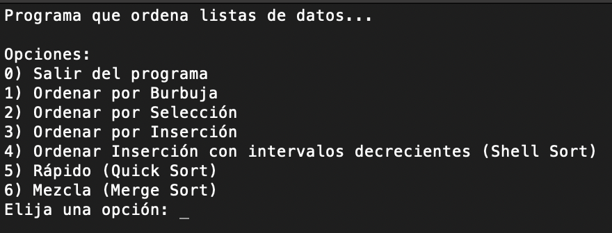

# Data Structure: Sorting methods in C++

This is an academic C++ project that visualizes multiple classic sorting algorithms directly in the terminal using ANSI escape codes. The project includes:

- Bubble Sort
- Selection Sort
- Insertion Sort
- Shell Sort
- Quick Sort
- Merge Sort

Each algorithm is animated in real time within the terminal to help students and enthusiasts understand how data is moved during the sort process.

---

## Visual Previews




### Algorithms

<p align="center">
  
  
  <br>
  
  
  
</p>

---

## Table of Contents

- [Features](#-features)
- [Requirements](#-requirements)
- [Setup & Usage](#-setup--usage)
- [Project Structure](#-project-structure)
- [Future Improvements](#-future-improvements)
- [License](#-license)
- [Author](#-author)

---

## Features

- Interactive terminal menu to select sorting algorithms
- Custom animation speed
- Clear terminal-based bar visualization
- Modular and well-organized C++ code
- Memory-safe operations and dynamic vector management

---

## ⚙ Requirements

- **OS**: macOS or Linux (ANSI escape codes for cursor movement)
- **Compiler**: `clang++` or `g++` supporting C++17
- **Terminal**: must support ANSI codes and use monospaced fonts like Menlo

You can install build tools using:

```bash
# For macOS
brew install llvm

# For Ubuntu/Linux
sudo apt install build-essential
```

---

## Setup & Usage

1. Clone the repository:

```bash
git clone https://github.com/ana-chenoweth/dsa-sorting-methods.git
cd dsa-sorting-methods
```

2. Compile the project:

```bash
clang++ -std=c++17 -stdlib=libc++ -g \
    main.cpp \
    utils/Utileria.cpp \
    gestion/HerramientasGestion.cpp \
    vectores/HerramientasVectores.cpp \
    utils/Menu.cpp \
    vectores/MetodosDeOrdenamiento.cpp \
    gestion/Gestiones.cpp \
    -o programa
```

3. Run the executable:

```bash
./programa
```

**Note**: For a smoother experience, make sure your terminal uses a real monospaced font (e.g., Menlo) and is wide enough for the sorting bars to render properly.

---

## For Windows users:
You can click in the executable to run it.

## Project Structure

```
.
├── main.cpp                   # Main menu and control logic
├── utils/                    # Menu and terminal utilities
├── gestion/                  # Sorting management and user input helpers
├── vectores/                 # Sorting implementations and vector tools
├── img/                      # Sorting visual GIFs for README
└── programa                  # Final compiled binary
```

---

## License

This project is licensed under the [MIT License](LICENSE).

---

## Author

Made by [Ana Chenoweth](https://github.com/ana-chenoweth)  
Part of academic coursework on Data Structures & Algorithms

---
